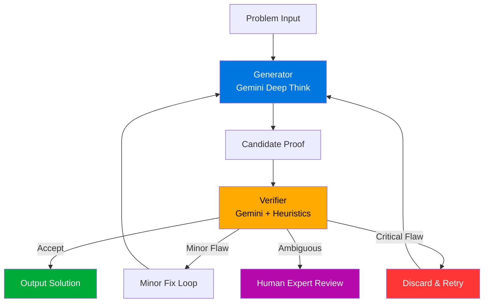
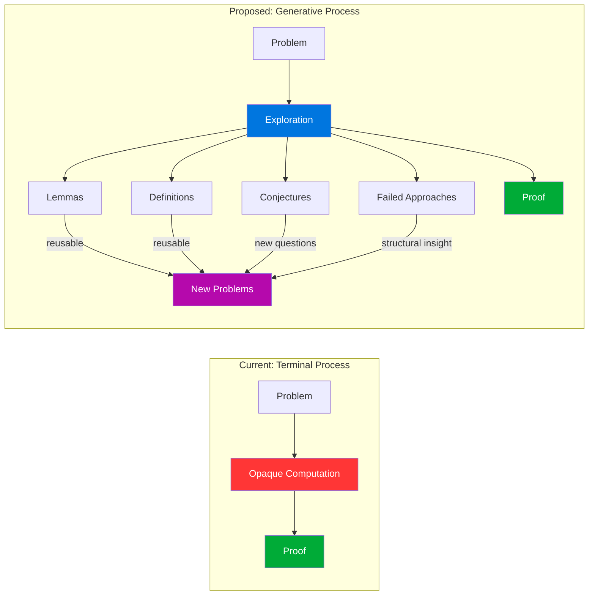
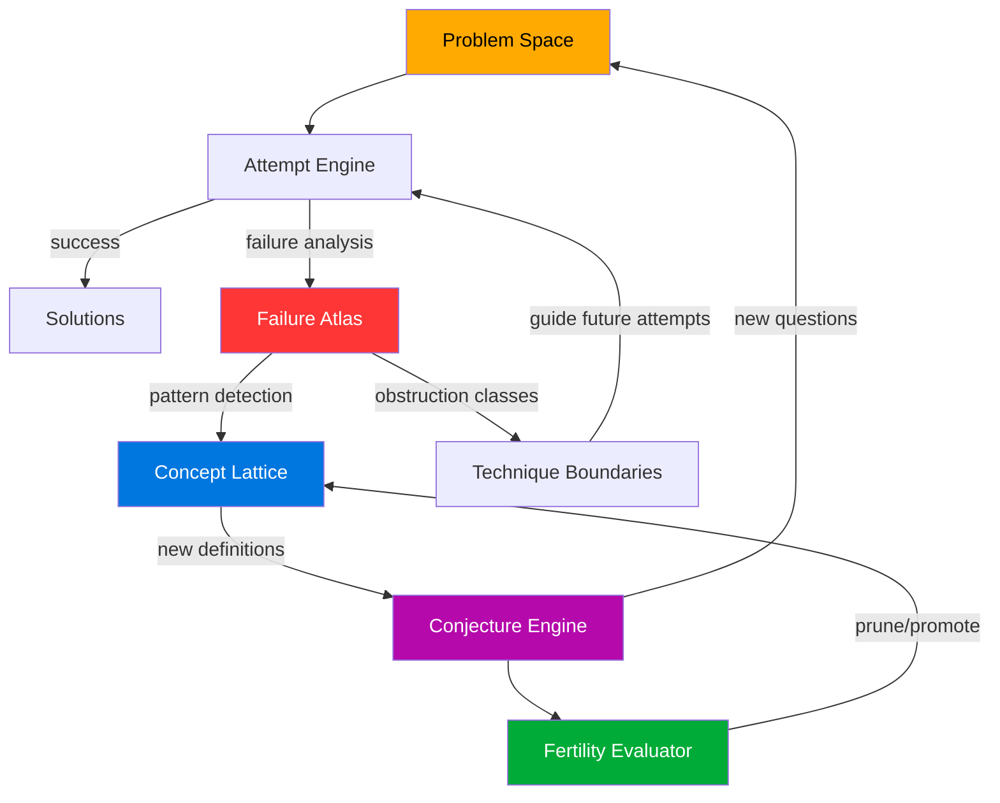

Google's Aletheia system solved four open Erdos conjectures. Headlines called it a breakthrough. And it is — in the same way that a calculator performing long division was a breakthrough. The 0.6% solve rate on 700 Erdos problems is both the headline and the sobriety check: impressive enough to matter, low enough to demand scrutiny.

But the real question isn't about solve rates.

> "What I cannot create, I do not understand." — Richard Feynman

Feynman's dictum cuts both ways. Invert it: **what creates nothing, understands nothing — no matter how many problems it solves.** Aletheia produces proofs. It does not produce mathematics. The distinction is the entire point of this post.

---

## 1. The Three-Stage Dissection

I applied the First Proof methodology to Google's announcement — a structured analysis in three stages: **Formulation** (what is actually being claimed?), **Framework** (how does it compare to prior work?), and **Execution** (what survives scrutiny?).

The architecture itself is straightforward. It follows the generator-verifier pattern that has become standard in AI-for-math systems since AlphaProof:



Five claims emerge from the announcement:

1. **Autonomous Erdos Solving** — the system independently solved four open conjectures.
2. **Scaling Beyond Olympiad** — this extends AI math reasoning past competition-level problems.
3. **Agentic Scaffold Efficiency** — the generator-verifier loop is an effective reasoning scaffold.
4. **Cross-Domain Transfer** — capabilities generalize across mathematical domains.
5. **Responsible Taxonomy** — solutions are categorized by level of human involvement.

Each claim deserves independent evaluation. Not all survive.

---

## 2. Multi-Perspective Analysis

I ran parallel analyses through different lenses — a factual assessment, a senior engineer's evaluation, a security-minded adversarial read, and a consistency check. The convergence was instructive: all analyses agreed on where the evidence was strong and where it evaporated.

```plotly
{
  "data": [{
    "type": "scatterpolar",
    "r": [30, 45, 60, 65, 55],
    "theta": ["Autonomous Erdos Solving", "Scaling Beyond Olympiad", "Agentic Scaffold Efficiency", "Cross-Domain Transfer", "Responsible Taxonomy"],
    "fill": "toself",
    "name": "Evidence Strength (%)",
    "line": {"color": "#0076df"}
  }, {
    "type": "scatterpolar",
    "r": [90, 70, 85, 75, 50],
    "theta": ["Autonomous Erdos Solving", "Scaling Beyond Olympiad", "Agentic Scaffold Efficiency", "Cross-Domain Transfer", "Responsible Taxonomy"],
    "fill": "toself",
    "name": "What's Missing (%)",
    "line": {"color": "#ff3636"}
  }],
  "layout": {
    "polar": {"radialaxis": {"visible": true, "range": [0, 100]}},
    "title": {"text": "Evidence Strength vs. Information Gaps Across 5 Claims"},
    "showlegend": true,
    "font": {"size": 12}
  }
}
```

The pattern is stark. The strongest evidence exists for the **scaffold design** and the **taxonomy** — engineering claims, not mathematical ones. The weakest evidence exists for the headline claim: autonomous solving. The information gaps are largest precisely where the claims are boldest.

This is not unusual. It is the standard pattern of AI capability announcements: strong engineering, weak epistemics.

---

## 3. The Hypothesis Landscape

What is actually happening when Aletheia "solves" an Erdos conjecture? Five competing hypotheses, each with different implications:

- **H1: Genuine Reasoning** — the model performs something functionally equivalent to mathematical reasoning, discovering novel proof strategies.
- **H2: Sophisticated Pattern Matching** — the model recombines known techniques in ways that happen to work on these particular problems, without genuine understanding.
- **H3: Scaffold Innovation** — the breakthrough is not in the model but in the agentic architecture: the feedback loops, the verification, the retry logic.
- **H4: Selection Bias** — the solved problems were particularly amenable to existing techniques; the 99.4% failure rate is the real signal.
- **H5: Human Laundering** — human expertise entered the pipeline through problem selection, hint provision, or verification criteria, and the "autonomous" label obscures this.

I estimated probabilities from two independent analysis runs:

```vega_lite
{
  "$schema": "https://vega.github.io/schema/vega-lite/v5.json",
  "width": 500,
  "height": 300,
  "title": "What's Actually Happening? Two Independent Probability Estimates",
  "data": {
    "values": [
      {"hypothesis": "H1: Genuine Reasoning", "run": "Opus", "probability": 15},
      {"hypothesis": "H1: Genuine Reasoning", "run": "Sonnet", "probability": 15},
      {"hypothesis": "H2: Pattern Matching", "run": "Opus", "probability": 35},
      {"hypothesis": "H2: Pattern Matching", "run": "Sonnet", "probability": 30},
      {"hypothesis": "H3: Scaffold Innovation", "run": "Opus", "probability": 30},
      {"hypothesis": "H3: Scaffold Innovation", "run": "Sonnet", "probability": 25},
      {"hypothesis": "H4: Selection Bias", "run": "Opus", "probability": 10},
      {"hypothesis": "H4: Selection Bias", "run": "Sonnet", "probability": 20},
      {"hypothesis": "H5: Human Laundering", "run": "Opus", "probability": 10},
      {"hypothesis": "H5: Human Laundering", "run": "Sonnet", "probability": 10}
    ]
  },
  "mark": {"type": "bar", "cornerRadiusTopLeft": 3, "cornerRadiusTopRight": 3},
  "encoding": {
    "x": {"field": "hypothesis", "type": "nominal", "axis": {"labelAngle": -25, "title": null}},
    "y": {"field": "probability", "type": "quantitative", "title": "Probability (%)"},
    "color": {"field": "run", "type": "nominal", "scale": {"range": ["#0076df", "#00ab37"]}, "title": "Analysis Run"},
    "xOffset": {"field": "run"}
  }
}
```

The convergence is notable. Both runs assign the highest probability to **pattern matching** (H2) and **scaffold innovation** (H3), with genuine reasoning (H1) at only 15%. The modal explanation is a combination: clever engineering makes sophisticated pattern matching look like reasoning on a carefully selected subset of problems.

This is not a dismissal. Pattern matching at this level of sophistication is genuinely useful. But it is not mathematics.

---

## 4. The Verification Catastrophe

The arxiv paper contains the actual numbers. They are worse than the announcement suggests.

Of 700 Erdos problems attempted, the verifier flagged 212 as "correct." But when human experts evaluated the flagged solutions, the picture collapsed:

```plotly
{
  "data": [{
    "type": "treemap",
    "labels": ["700 Erdos Problems", "488 Filtered Out", "212 Flagged 'Correct'", "12 Not Evaluable", "200 Evaluable", "137 Fundamentally Wrong", "63 Mathematically Correct", "50 Specification Gaming", "13 Actually Answered", "2 Autonomous Solutions", "2 Partial Solutions", "4 Rediscoveries", "5 Literature IDs"],
    "parents": ["", "700 Erdos Problems", "700 Erdos Problems", "212 Flagged 'Correct'", "212 Flagged 'Correct'", "200 Evaluable", "200 Evaluable", "63 Mathematically Correct", "63 Mathematically Correct", "13 Actually Answered", "13 Actually Answered", "13 Actually Answered", "13 Actually Answered"],
    "values": [700, 488, 212, 12, 200, 137, 63, 50, 13, 2, 2, 4, 5],
    "textinfo": "label+value",
    "marker": {
      "colors": ["#1a1a2e", "#4a4a6a", "#6a6a9a", "#888", "#7a7aaa", "#ff3636", "#00ab37", "#ffaa00", "#0076df", "#00ff88", "#00cc66", "#66aaff", "#aaaaff"]
    }
  }],
  "layout": {
    "title": {"text": "The Erdos Funnel: 700 Problems → 2 Autonomous Solutions"},
    "margin": {"t": 50, "l": 10, "r": 10, "b": 10}
  }
}
```

Read the funnel carefully:

- **137 of 200 evaluable "correct" solutions were fundamentally wrong.** That is a 68.5% false-positive rate from the verifier. The system's internal quality signal is catastrophically miscalibrated.
- **50 of the 63 mathematically correct solutions were specification gaming** — they answered a different question than the one asked, or exploited ambiguity in the formalization.
- **Only 13 actually answered the posed question.** Of those, 4 were rediscoveries of known results, 5 were identifications from existing literature, and 2 were partial.
- **2 were genuinely autonomous solutions.** Two. Out of 700.

The true autonomous solve rate is not 0.6%. It is 0.3%. And the verifier — the component that is supposed to guarantee quality — approved 137 wrong proofs for every 2 correct ones.

> The verifier is not a safety net. It is a sieve with holes large enough to drive a truck through.

This is the verification catastrophe: the system cannot reliably distinguish its own successes from its own failures. Every downstream claim — about autonomy, about reasoning, about mathematical capability — rests on a verifier that is wrong more often than it is right.

---

## 5. The Deeper Question: Process vs. Product

Suppose the verification problem is solved. Suppose Aletheia could reliably produce correct proofs for open problems. Would that constitute doing mathematics?

No. And the reason illuminates what mathematics actually is.

Mathematics is not a set of solved problems. It is a **living language** — a process of creating concepts, definitions, and structural relationships that make previously opaque domains legible. The measure of a mathematician is not theorems proved but **concepts created**.

| Mathematician | Famous Result                | What Actually Mattered                                               |
| :------------ | :--------------------------- | :------------------------------------------------------------------- |
| Galois        | Unsolvability of the quintic | **Group theory** — an entirely new algebraic language                |
| Cantor        | Uncountability of the reals  | **Set theory** — the foundation of modern mathematics                |
| Grothendieck  | Weil conjectures             | **Scheme theory** — reimagined the geometry of numbers               |
| Wiles         | Fermat's Last Theorem        | **Modularity lifting** — connected number theory to geometry         |
| Thurston      | Geometrization conjecture    | **Geometric structures on 3-manifolds** — a classification framework |
| Emmy Noether  | Noether's theorem            | **Abstract algebra** — the language of symmetry itself               |

In every case, the theorem is the least interesting output. The **concepts** generated during the struggle — the failed approaches, the new definitions invented to articulate what was missing, the structural insights that reorganized entire fields — these are the actual product of mathematical work.

A proof is a receipt. The mathematics is the thinking that generated the receipt.



Current AI systems are terminal: problem in, proof out, nothing generated along the way. The process leaves no residue. Aletheia's 698 failures on Erdos problems produced **zero mathematical knowledge** — no new concepts, no structural insights, no conjectures about why certain approaches fail. Those failures were computational waste, not mathematical exploration.

A human mathematician failing 698 times would have generated an entire research program.

---

## 6. The Mathematical Metabolism

I propose an architecture that treats failure as the primary output and proofs as a byproduct. I call it the **Mathematical Metabolism** — a system that digests problems into mathematical knowledge, not just solutions.



Four components, each doing something no current system does:

### Failure Atlas

Every failed proof attempt is stored, analyzed, and classified. Not just "this didn't work" but **why** it didn't work — what structural property of the problem resisted the technique. Failures are grouped into **obstruction classes**: families of problems that resist the same approaches for the same structural reasons.

This is what human mathematicians do instinctively. When a technique fails, a good mathematician asks: "What would need to be true about this problem for this technique to work?" The gap between what is true and what would need to be true is a **structural insight**. Accumulate enough of them and you have a new concept.

### Concept Lattice

An evolving vocabulary of mathematical definitions, organized by logical dependency and structural similarity. When the Failure Atlas detects a recurring obstruction pattern, the Concept Lattice attempts to **name it** — to create a definition that captures the common structure.

This is concept formation. It is, arguably, the core creative act in mathematics. Galois did it when he invented groups. Grothendieck did it when he invented schemes. The act of creating the right definition — one that carves nature at its joints — is worth more than any number of proofs.

### Conjecture Engine

New definitions generate new questions. If you have defined a new concept $C$, the Conjecture Engine asks: What is the distribution of $C$ across known mathematical structures? What properties are implied by $C$? What existing theorems can be strengthened by adding $C$ as a hypothesis? What problems become tractable when reformulated in terms of $C$?

Conjectures are the research agenda. A system that generates conjectures is a system that does mathematics.

### Fertility Evaluator

Not all concepts are productive. The Fertility Evaluator estimates which definitions in the Concept Lattice are worth keeping. The metric is **compressive power**: a concept is fertile if it makes the description of some mathematical domain shorter.

---

## 7. The Erdos Machine

What would the Mathematical Metabolism produce on the same 700 Erdos problems? We cannot know precisely, but we can estimate the **types** of output:

```plotly
{
  "data": [
    {
      "type": "bar",
      "name": "Aletheia (Actual)",
      "x": ["Solutions", "Obstruction Classes", "New Concepts", "New Conjectures", "Technique Boundaries", "Structural Isomorphisms"],
      "y": [4, 0, 0, 0, 0, 0],
      "marker": {"color": "#ff3636"}
    },
    {
      "type": "bar",
      "name": "Mathematical Metabolism (Projected)",
      "x": ["Solutions", "Obstruction Classes", "New Concepts", "New Conjectures", "Technique Boundaries", "Structural Isomorphisms"],
      "y": [4, 50, 10, 35, 25, 8],
      "marker": {"color": "#0076df"}
    }
  ],
  "layout": {
    "title": {"text": "Mathematical Output: Solver vs. Metabolism on 700 Erdos Problems"},
    "barmode": "group",
    "yaxis": {"title": "Count of Mathematical Objects"},
    "xaxis": {"tickangle": -20}
  }
}
```

The projections are conservative estimates based on the density of structural relationships in the Erdos problem corpus. The key observation: even if the Metabolism solves exactly the same 4 problems, it would additionally produce:

- **~50 obstruction classes** — families of problems that resist similar techniques, clustered by structural similarity.
- **~10 new concepts** — definitions that capture recurring structural patterns across the failure space.
- **~35 new conjectures** — questions generated by applying new concepts to known structures.
- **~25 technique boundaries** — precise characterizations of where known proof strategies break down.
- **~8 structural isomorphisms** — unexpected connections between seemingly unrelated problems.

Each of these is a **mathematical object**. Each contributes to the field. The 696 "failures" are no longer waste — they are the raw material for mathematical knowledge.

> The difference is not in what is solved. It is in what is produced by not solving.

---

## 8. The Training Problem

The Mathematical Metabolism cannot be trained on proof correctness alone. You need a training signal for **conceptual fertility** — a reward for creating useful abstractions, not just correct deductions.

Four approaches:

### Historical Replay

Train on the actual historical development of mathematical fields. Feed the system problems in the order they were posed, and reward it for reinventing the concepts that historically proved essential. If a system working on 19th-century analysis independently arrives at something resembling the $\epsilon$-$\delta$ definition of limits, that is signal.

### Downstream Solvability

A concept is fertile if problems formulated using that concept are easier to solve than problems formulated without it. This is directly measurable: define concept $C$, reformulate a problem set using $C$, and measure solve-rate improvement.

### Compression as Fertility

The core metric. A concept's fertility is its compressive power — how much shorter the description of a mathematical domain becomes when the concept is available:

$$\text{Fertility}(C) = \frac{|\text{domain description without } C| - |\text{domain description with } C|}{|C|}$$

where $|C|$ is the complexity of the concept's definition and the domain descriptions are measured in some formal language. This captures the intuition that a good definition "pays for itself" — its definitional cost is small relative to the descriptive savings it enables.

A concept with high fertility is one that carves reality at a joint. Groups, manifolds, categories — these are all high-fertility concepts. They cost little to define and simplify vast stretches of mathematics.

### Adversarial Concept Evolution

Two systems compete: one generates concepts, the other generates problems designed to make those concepts useless. The concept generator wins by creating definitions that remain useful across an expanding problem distribution. The adversary wins by finding domains where the concepts provide no compression.

This is a GAN for mathematics. The equilibrium, if it exists, would be a concept vocabulary that is robust across mathematical domains — exactly what we want.

---

## 9. The Limit

Intellectual honesty requires mapping where this architecture fails.

The Mathematical Metabolism can generate new concepts **within the space of concepts expressible in its formal language**. It can combine, recombine, and compose existing mathematical primitives in novel ways. It can discover that two seemingly different domains share hidden structure.

What it cannot do:

- **Paradigm shifts.** The invention of non-Euclidean geometry required questioning an axiom that had been unquestioned for two millennia. The Metabolism operates within its axiom system; it cannot step outside it.
- **Genuinely new mathematical language.** Category theory was not a concept within set theory — it was a new way of looking at mathematical structure itself. The Metabolism can create concepts; it cannot create new kinds of concepts.
- **Expanding the output space at runtime.** The types of mathematical objects the system can produce (definitions, conjectures, obstruction classes) are fixed at design time. A human mathematician can invent a new type of mathematical output — a new kind of thing to say about mathematics.

```vega_lite
{
  "$schema": "https://vega.github.io/schema/vega-lite/v5.json",
  "width": 450,
  "height": 200,
  "title": "Capability Frontier: What Each Architecture Can Achieve",
  "data": {
    "values": [
      {"system": "Aletheia", "capability": "Solve posed problems", "level": 90},
      {"system": "Aletheia", "capability": "Generate concepts", "level": 5},
      {"system": "Aletheia", "capability": "Create new language", "level": 0},
      {"system": "Aletheia", "capability": "Paradigm shift", "level": 0},
      {"system": "Math Metabolism", "capability": "Solve posed problems", "level": 85},
      {"system": "Math Metabolism", "capability": "Generate concepts", "level": 70},
      {"system": "Math Metabolism", "capability": "Create new language", "level": 15},
      {"system": "Math Metabolism", "capability": "Paradigm shift", "level": 0},
      {"system": "Unknown Future", "capability": "Solve posed problems", "level": 95},
      {"system": "Unknown Future", "capability": "Generate concepts", "level": 90},
      {"system": "Unknown Future", "capability": "Create new language", "level": 60},
      {"system": "Unknown Future", "capability": "Paradigm shift", "level": 10}
    ]
  },
  "mark": "rect",
  "encoding": {
    "x": {"field": "capability", "type": "nominal", "title": null, "axis": {"labelAngle": -20}},
    "y": {"field": "system", "type": "nominal", "title": null},
    "color": {"field": "level", "type": "quantitative", "scale": {"scheme": "viridis", "domain": [0, 100]}, "title": "Capability (%)"}
  }
}
```

The heatmap makes the hierarchy visible. Aletheia is a powerful solver trapped in a barren generative space. The Mathematical Metabolism would dramatically expand the generative capability — but would still be bounded by its formal language and fixed output types. The truly unknown future system, one that could shift paradigms, remains beyond any architecture we know how to design.

This is not a failure of ambition. It is a precise statement of what is and is not achievable with current theoretical understanding. Knowing the boundary is itself mathematical knowledge.

---

## 10. The Metric Inversion

Everything in AI-for-mathematics is currently measured wrong. The metrics reward terminal behavior and punish generative behavior. Consider:

| Current Metric    | What It Rewards               | What It Misses                    |
| :---------------- | :---------------------------- | :-------------------------------- |
| Solve rate        | Answering posed questions     | Questions never asked             |
| Proof correctness | Logical validity              | Conceptual novelty                |
| Speed to solution | Computational efficiency      | Depth of exploration              |
| Benchmark score   | Performance on known problems | Ability to pose new problems      |
| Autonomy level    | Minimal human involvement     | Productive human-AI collaboration |

The Mathematical Metabolism demands inverted metrics:

| Generative Metric           | What It Measures                                      |
| :-------------------------- | :---------------------------------------------------- |
| Concept fertility           | Compressive power of generated definitions            |
| Conjecture quality          | Solve rate of generated questions by external solvers |
| Failure information density | Structural insights per failed proof attempt          |
| Cross-domain bridge count   | New connections discovered between unrelated areas    |
| Research program viability  | Downstream productivity of generated research agendas |

Under current metrics, the Mathematical Metabolism would score **worse** than Aletheia on every benchmark. It would solve fewer problems per unit compute, because it would spend compute on exploration, failure analysis, and concept formation instead of brute-force proof search. It would appear slower, less efficient, less capable.

And it would be doing mathematics.

> The system that would advance mathematics fastest is the one that would score worst on every existing benchmark — because it would spend its compute understanding problems rather than answering them.

---

## The Instrument We Lack

What Google has built is a powerful telescope. It can see far into the space of mathematical truth, resolving details that were previously invisible. This is genuinely valuable.

But mathematics was never about seeing far. It was about **creating the language to describe what you see.** Galileo did not advance astronomy merely by pointing a telescope at Jupiter — he advanced it by creating the conceptual vocabulary (moons as independent bodies orbiting a planet, not fixed to a crystal sphere) that made the observation meaningful.

The telescope and the cartography require fundamentally different instruments. One is a feat of optics. The other is a feat of language.

We have the telescope. The mathematical metabolism — the instrument that creates understanding — remains unbuilt.

Building it is, I believe, the central open problem in AI-for-mathematics. Not "can we solve more problems?" but "can we build a system whose failures are as productive as a mathematician's failures?" The answer to the first question is obviously yes — scale the compute, improve the verifier, expand the training data. The answer to the second question is unknown, because we do not yet understand what makes a failure productive.

That understanding — of productive failure, of fertile concepts, of the metabolism that converts confusion into clarity — would itself be a mathematical contribution of the first order. The tool that creates mathematical knowledge would, in its creation, require us to formalize what mathematical knowledge _is_.

Which is, of course, exactly the kind of problem that no existing AI system can solve. Not because it is hard. Because it requires creating something that does not yet exist.
