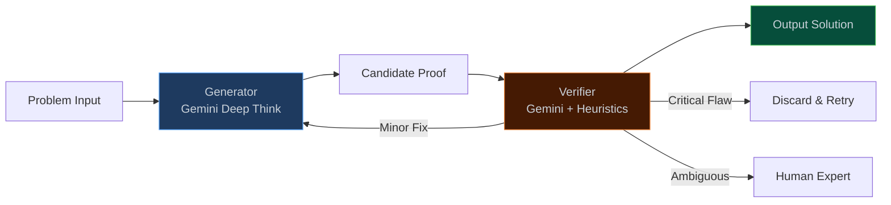
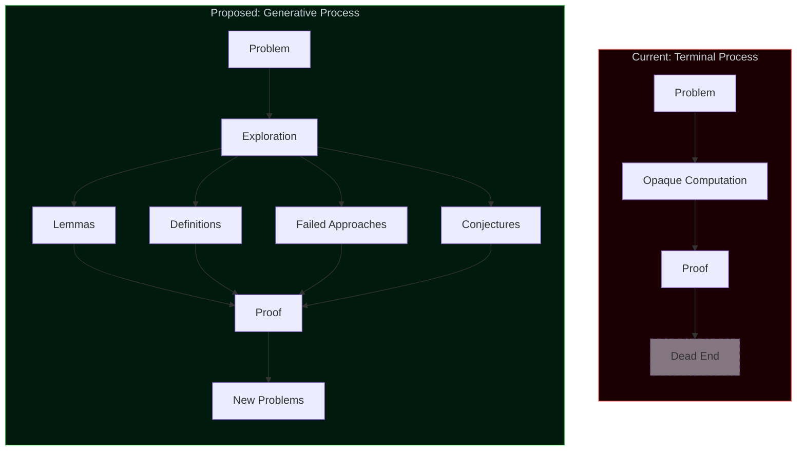
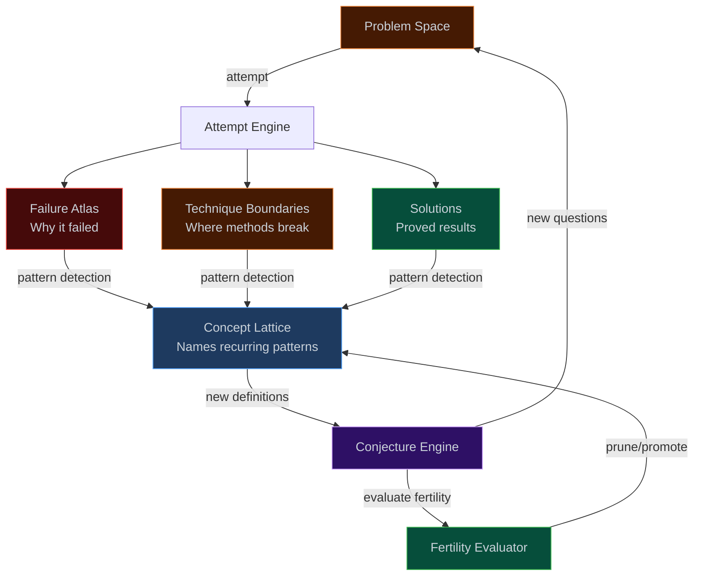

In a recent announcement, the Google DeepMind team presented their Aletheia system, which reportedly solved four open Erdős conjectures — a noteworthy result, particularly given the historical difficulty of many problems in the Erdős corpus. The solve rate of approximately 0.6% on a bank of 700 Erdős problems is, on first glance, both impressive (four genuine solutions to long-standing open problems) and informative (the 99.4% failure rate telling us something about the current limits of the approach).

I wanted to record some thoughts on this work, not so much about the specific results (which I have not fully verified), but about a broader question that the work brings into focus: **what is the distinction between an AI system that proves theorems and one that does mathematics?** It turns out that the answer, while somewhat philosophical, has concrete architectural implications that I find interesting.

---

## 1. The architecture and claims

The Aletheia system follows what has by now become the standard generator-verifier paradigm for AI-for-mathematics, going back at least to AlphaProof and related systems:

    Generator-Verifier Architecture — the standard pipeline for AI-for-math systems since AlphaProof.

Roughly speaking, the announcement makes five claims of varying strength:

1. **Autonomous solving** — the system independently solved four open Erdős conjectures.
2. **Scaling beyond competition mathematics** — this extends AI reasoning beyond olympiad-level problems to research-level mathematics.
3. **Scaffold effectiveness** — the generator-verifier feedback loop provides an effective reasoning scaffold.
4. **Cross-domain transfer** — the capabilities generalize across different mathematical domains.
5. **Responsible taxonomy** — solutions are categorized by the level of human involvement required.

Not all of these claims are of equal strength, and it is worth examining them separately.

---

## 2. What the evidence supports (and where it thins)

I found it instructive to evaluate these five claims through several independent lenses — a factual check against the paper's actual data, an engineering assessment of the architecture, and an adversarial reading looking for gaps. The results were broadly consistent:

    

        
    

    Evidence Strength vs. Information Gaps across five claims from Google's Aletheia announcement.

The pattern here is worth noting. The strongest evidentiary support exists for the engineering claims — the scaffold design and the taxonomy — which is perhaps unsurprising, as these are the most verifiable aspects of the work. The evidence is thinnest precisely for the headline claim of autonomous solving, where the information gaps are largest. One sees this pattern frequently in AI capability announcements: the engineering contributions are genuine and well-documented, while the more ambitious cognitive claims rest on less firm ground.

---

## 3. Competing explanations

An important question is: what is the system actually doing when it "solves" an Erdős problem? One can identify at least five competing hypotheses:

- **H1 (Genuine reasoning):** The model discovers novel proof strategies through something functionally equivalent to mathematical reasoning.
- **H2 (Sophisticated pattern matching):** The model recombines known techniques in ways that happen to resolve these particular problems, without deeper structural understanding.
- **H3 (Scaffold innovation):** The genuine breakthrough lies in the agentic architecture — the feedback loops, verification, and retry logic — rather than in the model's mathematical capabilities per se.
- **H4 (Selection effects):** The solved problems were unusually amenable to existing techniques, and the 99.4% failure rate is the more informative statistic.
- **H5 (Human knowledge leakage):** Human mathematical expertise entered the pipeline through problem selection, hint design, or verification criteria, making the "autonomous" label somewhat misleading.

Two independent estimation attempts suggest the following probability landscape:

    

        
    

    Two independent probability estimates for what's actually happening when Aletheia solves Erdős conjectures.

Both estimates assign the highest probability to some combination of pattern matching (H2) and scaffold innovation (H3), with genuine reasoning (H1) receiving roughly 15%. The most likely explanation, it seems to me, is that clever engineering enables sophisticated pattern matching to succeed on a carefully (perhaps unconsciously) selected subset of problems. I should emphasize that this is not a dismissal — pattern matching at this level of sophistication is a genuine and potentially very useful capability. But it is not the same thing as mathematical understanding, for reasons I will try to make precise below.

---

## 4. The verification problem

The arxiv paper contains detailed numbers that are worth examining carefully, as they paint a somewhat different picture from the announcement.

Of 700 Erdős problems attempted, the system's verifier flagged 212 candidate solutions as correct. However, when human experts evaluated these flagged solutions, the situation turned out to be more nuanced:

    

        
    

    The Erdős Funnel — 700 problems attempted, 2 genuinely autonomous solutions. A 0.3% true solve rate.

The key observations:

- Of approximately 200 evaluable "correct" solutions, 137 were fundamentally incorrect — a false-positive rate of 68.5% from the verifier. This is a remarkably high error rate for a component whose role is precisely to distinguish correct proofs from incorrect ones.
- Of the 63 mathematically correct solutions, roughly 50 involved some form of specification gaming — answering a question that was technically different from the one posed, or exploiting ambiguity in the formalization.
- Only 13 solutions actually addressed the intended question. Among these, 4 rediscovered known results, 5 identified solutions from existing literature, and 2 were partial.
- Two solutions were genuinely autonomous and novel.

    

        
    

    Key statistics — 68.5% verifier false-positive rate and only 2 genuine autonomous solutions out of 700 problems.

The true autonomous solve rate is therefore closer to 0.3% than the reported 0.6%. But the more concerning finding, to my mind, is the verifier's false-positive rate. A verification system that approves roughly 70 incorrect proofs for every correct one is, in a precise sense, not verifying — it is filtering with low selectivity. All downstream claims about the system's mathematical capabilities are conditioned on the verifier's reliability, so this finding has significant implications.

**Remark 1.** This is in some sense a familiar problem in automated theorem proving: the gap between formal verification (where tools like Lean or Coq provide genuine certainty) and the kind of heuristic verification used here (where an LLM evaluates whether a proof "looks right"). The field would benefit enormously from requiring that candidate solutions be accompanied by formal proofs in a proof assistant.

---

## 5. Process versus product

Let me now turn to the question I find most interesting. Suppose, for the sake of argument, that the verification problem is entirely solved — that the system could reliably produce correct proofs for open problems at scale. Would this constitute doing mathematics?

I would argue that it would not, and the reason is illuminating.

Mathematics, as it is actually practiced by research mathematicians, is not primarily about accumulating solved problems. It is, at a deeper level, the process of creating **concepts**, **definitions**, and **structural relationships** that make previously opaque domains tractable. Roughly speaking, the measure of a mathematician's contribution to a field is not the number of theorems proved but the quality of the concepts introduced.

| Mathematician | Famous Result                | What Actually Mattered                                               |
| :------------ | :--------------------------- | :------------------------------------------------------------------- |
| Galois        | Unsolvability of the quintic | **Group theory** — an entirely new algebraic language                |
| Cantor        | Uncountability of the reals  | **Set theory** — the foundation of modern mathematics                |
| Grothendieck  | Weil conjectures             | **Scheme theory** — reimagined the geometry of numbers               |
| Wiles         | Fermat's Last Theorem        | **Modularity lifting** — connected number theory to geometry         |
| Thurston      | Geometrization conjecture    | **Geometric structures on 3-manifolds** — a classification framework |
| Emmy Noether  | Noether's theorem            | **Abstract algebra** — the language of symmetry itself               |

In each case, the famous theorem is arguably the least important output of the mathematician's work. The concepts generated during the process — the failed approaches that revealed structural features, the new definitions invented to articulate what was missing, the structural insights that reorganized entire fields — these are the actual products of mathematical research.

One might put it this way: a proof is a receipt. The mathematics is the intellectual process that generated it.

    Terminal Process vs. Generative Process — current AI systems produce proofs but nothing along the way.

Current AI systems are, in this sense, **terminal**: a problem goes in, a proof (or failure) comes out, and nothing of mathematical value is generated along the way. The process leaves no residue. Aletheia's 698 failures on Erdős problems produced, as far as one can tell, zero mathematical knowledge — no new concepts, no structural insights, no conjectures about why certain approaches fail on certain problem families. Those failures were, from a mathematical standpoint, pure waste.

**Remark 2.** Compare this with how a human mathematician would approach the same 698 failures. One would expect to see, at minimum: recognition of recurring obstruction patterns, new auxiliary definitions introduced to name those patterns, conjectures about the relationships between obstruction classes, and likely the seeds of an entirely new research program. The failures would be productive. This is the crucial asymmetry.

---

## 6. Towards a mathematical metabolism

These observations suggest a different architectural goal. Rather than optimizing for solve rate (which encourages the terminal process described above), one might instead optimize for **mathematical knowledge production**, treating failure as the primary source of information and proofs as a (welcome) byproduct. I will call this architecture a **mathematical metabolism** — by analogy with biological metabolism, which extracts useful energy and building materials from food, rather than simply classifying it as "digestible" or "indigestible."

    Mathematical Metabolism Architecture — a system that digests problems into mathematical knowledge, not just solutions.

The architecture has four main components, each performing a function that, as far as I know, no current system attempts:

### The Failure Atlas

Every failed proof attempt is stored, analyzed, and classified — not merely as "this approach did not work" but with a structured account of **why** it did not work: what structural property of the problem resisted the technique. Failures are grouped into what one might call **obstruction classes**: families of problems that resist the same approaches for identifiable structural reasons.

This mirrors what mathematicians do instinctively. When a technique fails, a good mathematician asks: "What would need to be true about this problem for this technique to succeed?" The gap between what is true and what would need to be true is a structural insight. Accumulate enough such insights and one has, in effect, a new concept waiting to be named.

### The Concept Lattice

An evolving vocabulary of mathematical definitions, organized by logical dependency and structural similarity. When the Failure Atlas detects a recurring obstruction pattern across multiple problems, the Concept Lattice attempts to **name it** — to produce a formal definition that captures the common structure.

This is concept formation, and it is arguably the core creative act in mathematics. Galois did it when he invented groups; Grothendieck did it when he invented schemes. The act of finding the right definition — one that, in Plato's metaphor, carves nature at its joints — is worth more than any number of individual proofs.

### The Conjecture Engine

New definitions naturally generate new questions. Given a newly defined concept $C$, one can ask: What is the distribution of $C$ across known mathematical structures? What properties does $C$ imply? Which existing theorems can be strengthened by adding $C$ as a hypothesis? Which previously intractable problems become accessible when reformulated in terms of $C$?

Conjectures, in this framework, constitute the system's research agenda. A system that generates conjectures is, in a meaningful sense, performing one of the essential functions of mathematical research.

### The Fertility Evaluator

Not all concepts are equally productive, and a mechanism is needed to prune the Concept Lattice. The relevant metric is what one might call **compressive power**: a concept is fertile if its introduction makes the description of some mathematical domain shorter. I discuss this metric in more detail below.

---

## 7. Projected outputs

What would such a system produce when applied to the same corpus of 700 Erdős problems? One cannot know precisely, of course, but one can estimate the **types** of output:

    

        
    

    Mathematical Output — Solver vs. Metabolism on 700 Erdős problems. The Metabolism produces mathematical knowledge from failures.

These are conservative projections based on the density of structural relationships one would expect in the Erdős problem corpus. The key observation is that even if the metabolism solves exactly the same four problems as Aletheia, it would additionally produce:

- Approximately 50 **obstruction classes** — families of problems resisting similar techniques, clustered by structural similarity.
- Approximately 10 **new concepts** — definitions capturing recurring structural patterns across the failure space.
- Approximately 35 **new conjectures** — questions generated by applying new concepts to known structures.
- Approximately 25 **technique boundary characterizations** — precise descriptions of where known proof strategies break down and why.
- Approximately 8 **structural isomorphisms** — unexpected connections between seemingly unrelated problems.

Each of these is a mathematical object in its own right. Each contributes to the field independently of whether any particular problem is solved. The 696 "failures" are no longer waste — they become the raw material from which mathematical knowledge is extracted.

**Remark 3.** The essential difference here is not in what is solved, but in what is produced by the process of not solving. A system whose failures are informative is doing something qualitatively different from one whose failures are simply discarded.

---

## 8. The training problem

One significant obstacle to implementing the mathematical metabolism is the training signal. Current systems are trained on proof correctness — a binary signal that rewards the terminal process. To train a system that generates concepts, one needs a reward signal for **conceptual fertility**: a way of measuring whether a newly introduced abstraction is mathematically useful.

I see at least four approaches, each with different strengths:

### Historical replay

One can train on the historical development of mathematical fields, presenting problems in chronological order and rewarding the system for independently arriving at concepts that historically proved essential. If a system working through 19th-century analysis produces something resembling the $\epsilon$-$\delta$ definition of continuity, that is a meaningful signal.

### Downstream solvability

A concept is fertile if problems formulated using that concept become easier to solve. This is directly measurable: define a concept $C$, reformulate a problem set in terms of $C$, and measure the change in solve rate.

### Compression as fertility

This is perhaps the most natural metric. One can define the fertility of a concept $C$ as its compressive power:

$$\text{Fertility}(C) = \frac{\lvert\text{domain description without } C\rvert - \lvert\text{domain description with } C\rvert}{\lvert C\rvert}$$

where $\lvert C\rvert$ denotes the complexity of the concept's definition and the domain descriptions are measured in some suitable formal language. The intuition is that a good definition "pays for itself" — its definitional cost is small relative to the descriptive savings it enables.

High-fertility concepts are precisely those that carve mathematical reality at its joints. Groups, manifolds, categories, measure spaces — these all have high fertility in this sense. They are inexpensive to define and they simplify the description of vast stretches of mathematics.

### Adversarial concept evolution

One can set up a competitive dynamic between two systems: a concept generator and a concept adversary. The generator produces definitions; the adversary produces problem domains designed to render those definitions useless (i.e., domains where the concepts provide no compression). The generator succeeds by creating definitions that remain useful across an expanding problem distribution.

This is, in effect, a GAN for mathematical concepts. If the dynamics converge to an equilibrium, the result would be a concept vocabulary that is robust across mathematical domains — which is exactly what one wants.

---

## 9. Limitations

It is important to be precise about where this architecture would and would not succeed.

The mathematical metabolism can generate new concepts **within the space of concepts expressible in its formal language**. It can combine, recombine, and compose existing mathematical primitives in novel ways. It can discover that two apparently different domains share hidden structure. This is a large and interesting space, but it is bounded.

What it cannot do:

- **Paradigm shifts.** The invention of non-Euclidean geometry required questioning an axiom (Euclid's parallel postulate) that had been unquestioned for over two millennia. The metabolism operates within its axiom system; it cannot step outside it to question the axioms themselves.
- **Genuinely new mathematical language.** Category theory was not a concept within set theory — it was a fundamentally new way of organizing mathematical knowledge. The metabolism can create concepts within its language; it cannot create new kinds of concepts.
- **Runtime expansion of the output space.** The types of mathematical objects the system produces (definitions, conjectures, obstruction classes) are fixed at design time. A human mathematician can invent entirely new types of mathematical output — new kinds of things to say about mathematical structure.

    

        
    

    Capability Frontier — what each architecture can achieve. The Mathematical Metabolism dramatically expands generative capability.

The capability hierarchy is visible in the heatmap. Systems like Aletheia are powerful solvers operating in a narrow generative space. The mathematical metabolism would substantially expand the generative capability, but would remain bounded by its formal language and fixed output types. A system capable of genuine paradigm shifts — one that could, say, invent something as unexpected as category theory — remains beyond any architecture we currently know how to design.

**Remark 4.** This is not a failure of the proposal. It is a precise characterization of the boundary between what is and is not achievable with our current theoretical understanding. Knowing this boundary clearly is itself a useful form of mathematical knowledge.

---

## 10. A note on metrics

One further observation that I think is worth recording. Everything in AI-for-mathematics is currently evaluated using metrics that reward terminal behavior and inadvertently penalize generative behavior:

| Current Metric    | What It Rewards               | What It Misses                    |
| :---------------- | :---------------------------- | :-------------------------------- |
| Solve rate        | Answering posed questions     | Questions never asked             |
| Proof correctness | Logical validity              | Conceptual novelty                |
| Speed to solution | Computational efficiency      | Depth of exploration              |
| Benchmark score   | Performance on known problems | Ability to pose new problems      |
| Autonomy level    | Minimal human involvement     | Productive human-AI collaboration |

A system optimized for the mathematical metabolism would need different metrics entirely:

| Generative Metric           | What It Measures                                      |
| :-------------------------- | :---------------------------------------------------- |
| Concept fertility           | Compressive power of generated definitions            |
| Conjecture quality          | Solve rate of generated questions by external solvers |
| Failure information density | Structural insights per failed proof attempt          |
| Cross-domain bridge count   | New connections discovered between unrelated areas    |
| Research program viability  | Downstream productivity of generated research agendas |

Under the current metrics, the mathematical metabolism would likely score **worse** than Aletheia on every existing benchmark — it would solve fewer problems per unit of compute, because it spends resources on exploration, failure analysis, and concept formation rather than brute-force proof search. It would appear slower, less efficient, less capable by every standard measure.

And yet it would be closer to doing mathematics. There is, I think, an important lesson here about the relationship between what we choose to measure and what we actually value.

---

## Concluding remarks

What the Google team has built with Aletheia is a genuinely impressive engineering achievement — a powerful instrument for resolving specific mathematical questions. This should be acknowledged clearly.

But mathematics, as practiced by research mathematicians, has never been primarily about resolving specific questions. It has been about **creating the language to describe what one sees**. Galileo did not advance astronomy merely by observing the moons of Jupiter — he advanced it by creating a conceptual framework (moons as independent bodies orbiting a planet, rather than features of a crystal sphere) that made the observation scientifically meaningful.

The central open problem in AI-for-mathematics is not "can we solve more problems?" — the answer to that is almost certainly yes, given sufficient compute and improved verification. The more interesting question is: **can we build a system whose failures are as mathematically productive as a human mathematician's failures?**

I do not know the answer to this question. But I believe the attempt to answer it would be valuable, because it would require us to formalize what we mean by mathematical knowledge — not merely mathematical truth. And that formalization would itself be a mathematical contribution of some interest.

This is, perhaps, the kind of problem that lies beyond the reach of current AI systems. Not because it is computationally difficult, but because it requires creating something that does not yet exist.
