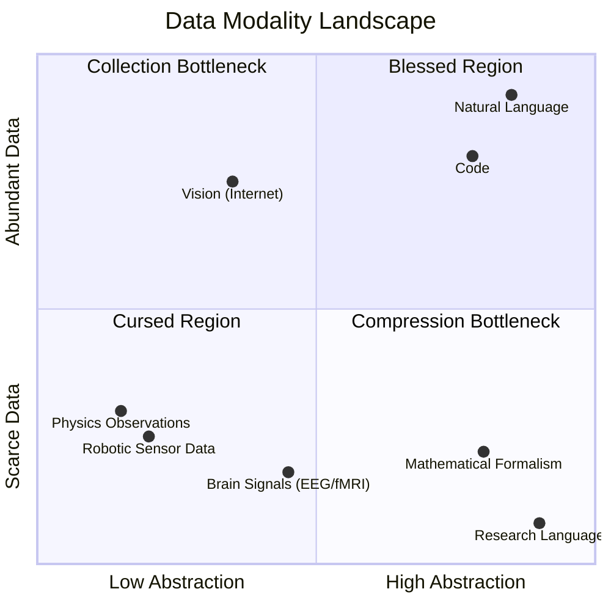
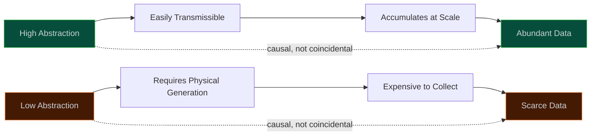
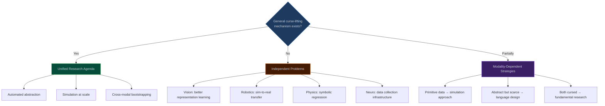

Ziming Liu recently published a short but thought-provoking piece titled ["If not LLMs, what should I work on?"](https://KindXiaoming.github.io/blog/2026/everything-is-language/) — a question that I suspect many AI researchers have been quietly asking themselves. His answer, compressed to a sentence: the most promising work lies in data modalities that are unlike natural language, precisely because they lack the properties that made language models so successful.

I wanted to engage with this piece carefully, because the question it poses is important and the framing it offers is both illuminating and, I think, subtly incomplete. The diagnosis is sharp. The prescription needs more structure.

---

## 1. Liu's argument, compressed

The core framework is a two-dimensional taxonomy. All data modalities — text, vision, robotics, brain signals, physics observations, mathematical formalisms — are "languages." These languages differ along two axes:

1. **Abstraction level** — how compressed the data is relative to raw physical reality.
2. **Data availability** — how much of it exists at scale.

Natural language sits in a uniquely blessed position: high abstraction *and* abundant data. Everything else falls into one of the "cursed" quadrants. Liu's thesis is that these cursed regions are the blue ocean — the unexploited space where genuine innovation is both possible and necessary.

Three subsidiary claims follow:

- **More primitive languages demand stronger models.** When data isn't pre-compressed by evolution or culture, the model must do the compression work. This explains why representation learning is harder in vision than in NLP.
- **Some languages don't exist yet.** Liu proposes that AI research itself needs a new formal language — more abstract and compressed than natural language — to make progress. "Physics of AI" is offered as a candidate.
- **Continual learning isn't solved outside NLP.** In-context learning and RLHF have made NL continual learning tractable, but "native" continual learning in other modalities — learning within the modality itself, without NL scaffolding — remains wide open.

---

## 2. What holds up

The piece's strongest contribution is what I'd call the **compression-burden thesis**: when data is primitive, the model must perform the work that evolution and culture already performed for natural language.

This is an underappreciated insight with real explanatory power. Consider the asymmetry:

| Modality | Who did the compression? | Time invested | Model's remaining burden |
|:---------|:------------------------|:-------------|:------------------------|
| Natural language | Millions of years of evolution + thousands of years of cultural refinement | ~100,000 years | Low — learn the structure that's already there |
| Vision | Biological vision systems (retina → V1 → V4 → IT) | ~500M years | Medium — learn the hierarchy evolution built |
| Robotic sensor data | Nobody | 0 years | High — must discover structure from scratch |
| Raw physics observations | Nobody (until Kepler, Newton, etc.) | 0 years | Very high — must rediscover symbolic laws |

This table makes precise something that is often hand-waved: the reason NLP is "easier" for current architectures isn't that language is simpler than vision or physics. It's that language has already been compressed by an extraordinarily powerful optimization process (evolution + culture) before it reaches the model. The model is learning a *compressed representation of a compressed representation*. For robotic sensor data, the model is learning from raw signal — no prior compression, no inherited structure.

The practical implication is concrete: **scaling laws that hold for natural language should not be expected to transfer to primitive modalities.** The data requirements, the architectural demands, and the training dynamics may be fundamentally different when the compression burden falls on the model rather than on the data.

Liu is also right that the success of NL continual learning (via context windows, RAG, tool use) cannot be naively extrapolated. These techniques work because natural language is already a shared protocol between human and model. For a robotic agent learning from proprioceptive signals, there is no equivalent of "just put it in the prompt."

---

## 3. Where the argument thins

### 3.1 Compression is not abstraction

The piece treats these as synonyms. They are not.

A JPEG is compressed. A physical law is abstract. A Huffman code is compressed. A mathematical definition is abstract. Compression removes redundancy; abstraction extracts *decision-relevant structure*. The distinction matters because the research agenda for each is different:

- If the problem is **compression**, the answer is better encoders — autoencoders, VQ-VAEs, information bottleneck methods. This is an engineering problem with a well-understood theoretical framework (rate-distortion theory).
- If the problem is **abstraction**, the answer is discovering the right *concepts* — the entities, relations, and symmetries that make the domain tractable. This is closer to scientific discovery than to engineering.

Natural language is both compressed *and* abstract, which makes it easy to conflate the two. But for "cursed" modalities, we need to be precise about which problem we're solving. A robot that learns an excellent compressed representation of sensor data has not necessarily learned anything *abstract* — it may have a very efficient encoding of noise.

Gell-Mann and Lloyd's distinction between Kolmogorov complexity and *effective complexity* is relevant here. The effective complexity of a system is the length of its regularities — the part that is neither random nor trivially compressible. What we want models to learn from primitive data is effective complexity, not compression in general.

### 3.2 The axes are not independent

Liu presents abstraction and data availability as orthogonal axes. But they are deeply correlated, and the correlation is not incidental — it may be the core constraint.

Natural language is abundant *because* it is abstract. Abstraction is precisely what makes information transmissible, storable, and reproducible at scale. You can tweet a sentence; you cannot tweet a proprioceptive trajectory. The internet is a repository of abstract representations *by construction* — it's a network for transmitting human language and its close derivatives (images with captions, code with documentation).

Robotic sensor data is scarce *because* it is primitive. Generating it requires physical actuators in physical environments. Brain data is scarce because collecting it requires expensive equipment attached to living subjects. These aren't independent facts about the data — they're consequences of where the data sits on the abstraction axis.

This means the "cursed region" isn't an arbitrary quadrant — it's the *expected* region for primitive modalities. The curse is structural, not accidental. And this has implications for strategy: you cannot "fix" data scarcity for primitive modalities by building better data pipelines, because the scarcity is a consequence of the modality's nature, not of insufficient infrastructure.

### 3.3 The research language proposal is circular

Liu's most provocative claim is that we need to *create* a new language for AI research — one that is "more abstract and more compressed" than natural language. "Physics of AI" is offered as a candidate.

But consider the bootstrapping problem. Liu's own framework tells us that languages in the "data-scarce, high-abstraction" quadrant are exactly the ones that need scale to be useful and can't achieve scale without adoption. Who produces the first million tokens of "Physics of AI" language? Who trains the model that learns it? How does it reach the critical mass needed for pretraining?

Natural language didn't face this problem because it evolved organically over millennia, with selection pressure at every step. Mathematical notation reached its current form through centuries of practitioner refinement. These languages weren't designed — they were selected for. Proposing to *design* a research language is a categorically different kind of task, and the piece doesn't engage with the mechanism by which it would achieve scale.

This isn't a fatal objection — formal languages have been successfully introduced before (programming languages, mathematical notation for specific fields). But those succeeded by offering immediate utility to practitioners who adopted them voluntarily. The value proposition for "Physics of AI" as a language needs to be made concrete: what can you express in it that you can't express in mathematics + natural language? What is the incentive for individual researchers to invest in learning and producing it?

### 3.4 The Bitter Lesson engagement doesn't land

Liu (via Saining Xie) argues that natural language's success is a *counterexample* to the Bitter Lesson, because NL itself is "a beautifully structured artifact — a gift from natural evolution."

But Sutton's Bitter Lesson is specifically about **researcher-designed** inductive biases versus **learned** representations. It argues that hand-crafted features and domain-specific architectures consistently lose to general methods plus scale. Natural language's structure wasn't designed by ML researchers — it was present in the data. The Bitter Lesson is entirely compatible with "leverage well-structured data when you have it."

The real question — the one Liu's argument needs to address — is: **when you don't have well-structured data (the cursed region), does the Bitter Lesson reassert itself?** That is, should we invest in domain-specific inductive biases for robotics and physics, or should we bet on general architectures plus more data? Liu seems to favor the former ("we must leverage human intuition to inject better representations"), but the Bitter Lesson argument against this position is not addressed.

This is not an academic quibble. It determines whether the right strategy for the cursed region is to build better architectures (the "sweet lesson" approach) or to find ways to generate more data (the Bitter Lesson approach — simulation, synthetic data, self-play). These are very different research agendas.

---

## 4. The question the piece doesn't ask

The deepest question Liu's framework raises but doesn't answer:

> **Is there a general mechanism for converting a cursed language into a blessed one?**

If yes, then the research agenda is to find that mechanism — and it would likely involve some combination of:

1. **Automated abstraction** — models that learn to compress primitive data into abstract representations that are themselves transmissible and composable (i.e., that *create* language from raw signal).
2. **Simulation as data generation** — using physics simulators to generate unlimited primitive data, bypassing the physical collection bottleneck.
3. **Cross-modal bootstrapping** — using NL as a scaffold to bootstrap learning in primitive modalities, then gradually removing the scaffold.

If no — if each modality is its own special case — then Liu's unifying framework dissolves into a list of independent research problems. Still valuable as a diagnostic, but not a paradigm.

My intuition — and it is only that — is that the answer is "partially." Some modalities (vision, audio) are close enough to natural language's position that cross-modal transfer and simulation can lift them into the blessed region. Others (raw physics, brain signals) are so deeply cursed that they require modality-specific breakthroughs in representation learning. And the "research language" proposal sits in a third category entirely — a language that must be *designed* rather than *discovered*, which is a social engineering problem as much as a technical one.

---

## 5. What to actually do

If I were an AI researcher using Liu's framework to choose a direction, I would extract these operational principles:

**1. Don't extrapolate from NLP.** The most reliable takeaway from the piece. If your research plan assumes that "what worked for language will work for X," you need a specific argument for why, not a vague appeal to scaling.

**2. Ask "who did the compression?" for your modality.** This is the piece's sharpest diagnostic tool. If nobody has compressed the data before you — if there is no evolutionary or cultural prior — expect the problem to be qualitatively harder, not just quantitatively larger.

**3. Distinguish compression from abstraction.** If your model learns to compress sensor data efficiently, that's necessary but not sufficient. The test is whether the learned representations support *transfer* and *composition* — whether they behave like abstractions, not just like encodings.

**4. Prefer modalities where simulation can break the data bottleneck.** Robotics (sim-to-real), physics (numerical simulation), and even aspects of vision (synthetic rendering) have a path around the data scarcity problem. Brain data does not, which makes it a fundamentally different kind of bet.

**5. The Bitter Lesson question is empirical, not philosophical.** For each modality, the question "do inductive biases help or hurt at scale?" has an empirical answer. Don't assume it's the same answer across modalities.

---

## 6. Conclusion

Liu's piece is valuable primarily as a diagnostic — a framework for understanding *why* natural language occupies a privileged position in the current AI landscape, and why success in NLP should not be expected to transfer to other domains. The compression-burden thesis is the strongest contribution: primitive modalities demand that models do work that evolution and culture already did for language.

Where the piece is less satisfying is in the prescription. The 2D taxonomy, while evocative, obscures the causal structure of the problem (the axes aren't independent), conflates compression with abstraction, and doesn't address the bootstrapping challenge for new languages. The engagement with the Bitter Lesson leaves the most important question — what to do when you *lack* well-structured data — unanswered.

The deepest question the piece surfaces is whether a general mechanism exists for lifting the curse. I suspect the answer is modality-dependent, which means the "blue ocean" is really several distinct oceans, each requiring different navigational tools. That's less elegant than a unified framework, but it may be closer to the truth.

> What I cannot create, I do not understand. But what I cannot compress, I cannot yet create.

---

*This post is a response to Ziming Liu's ["If not LLMs, what should I work on?"](https://KindXiaoming.github.io/blog/2026/everything-is-language/) (April 2026). I found the piece stimulating and worth engaging with seriously, which is the spirit in which these critiques are offered.*
